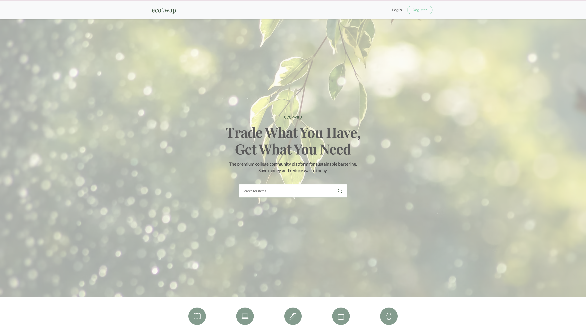
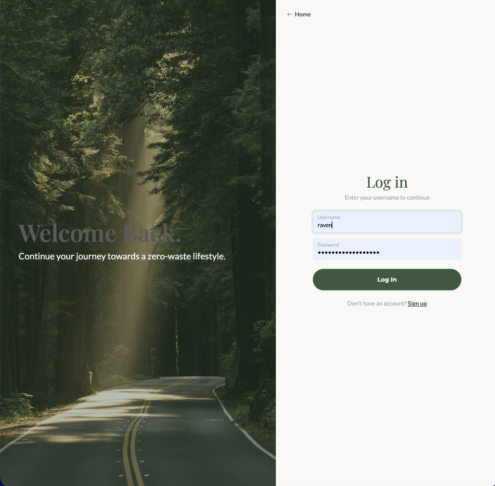
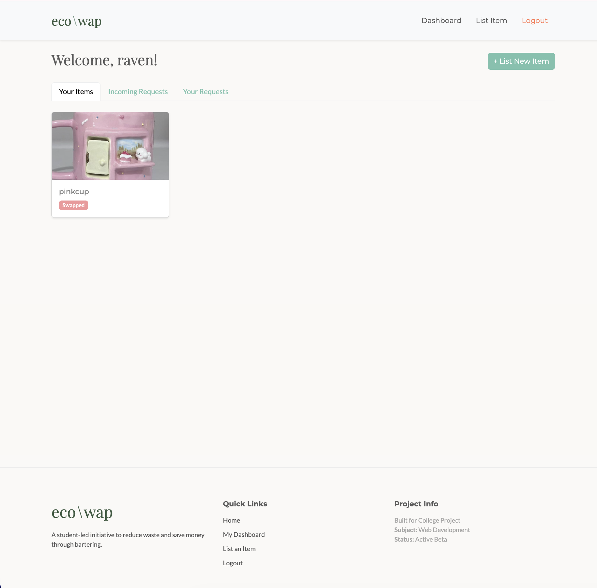
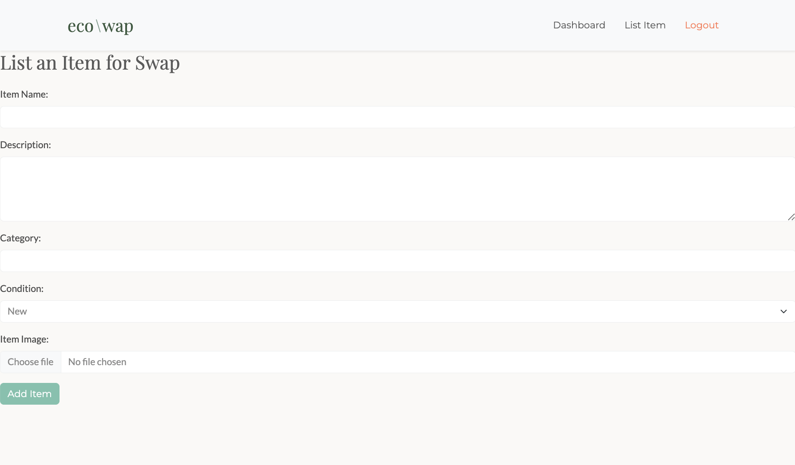
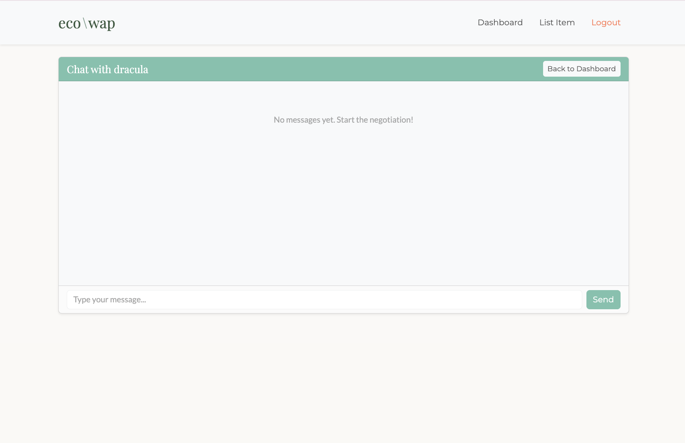

# EcoSwap - Sustainable Bartering Platform 🌿

EcoSwap is a full-stack web application designed for college communities to trade items (books, electronics, dorm essentials) without spending money. It promotes sustainability by extending the lifecycle of goods.

 


## 🚀 Features

* **Smart Authentication:** Secure Login/Register system supporting both Username and Email.
* **Item Listing:** Users can upload items with images, categories, and condition descriptions.
* **Barter Logic:** A robust request system where users can offer items in exchange for others.
* **Real-time Status:** Tracks swap states from `Pending` → `Accepted` → `Declined`.
* **Negotiation Chat:** Once a swap is accepted, a private chat channel opens between the two users.
* **Responsive UI:** Fully responsive design using the Bootswatch "Minty" theme.

## 🛠️ Tech Stack

* **Frontend:** HTML5, CSS3, Bootstrap 5 (Minty Theme), JavaScript.
* **Backend:** Native PHP (Object-Oriented style).
* **Database:** MySQL.
* **Server:** Apache (via XAMPP).

## ⚙️ Installation & Setup

1.  **Clone the Repo**
    ```bash
    git clone [https://github.com/yourusername/ecoswap.git](https://github.com/yourusername/ecoswap.git)
    ```
2.  **Move Files**
    * Move the `ecoswap` folder into your XAMPP `htdocs` directory (e.g., `C:/xampp/htdocs/ecoswap`).
3.  **Setup Database**
    * Open XAMPP and start **Apache** and **MySQL**.
    * Go to `http://localhost/phpmyadmin`.
    * Create a new database named `ecoswap`.
    * Import the `ecoswap.sql` file provided in this repository.
4.  **Run the App**
    * Open your browser and visit `http://localhost/ecoswap`.

## 📸 Screenshots

| Login Page | Dashboard |
| :---: | :---: |
|  |  |

| Item View | Chat Interface |
| :---: | :---: |
|  |  |# ecoswap
